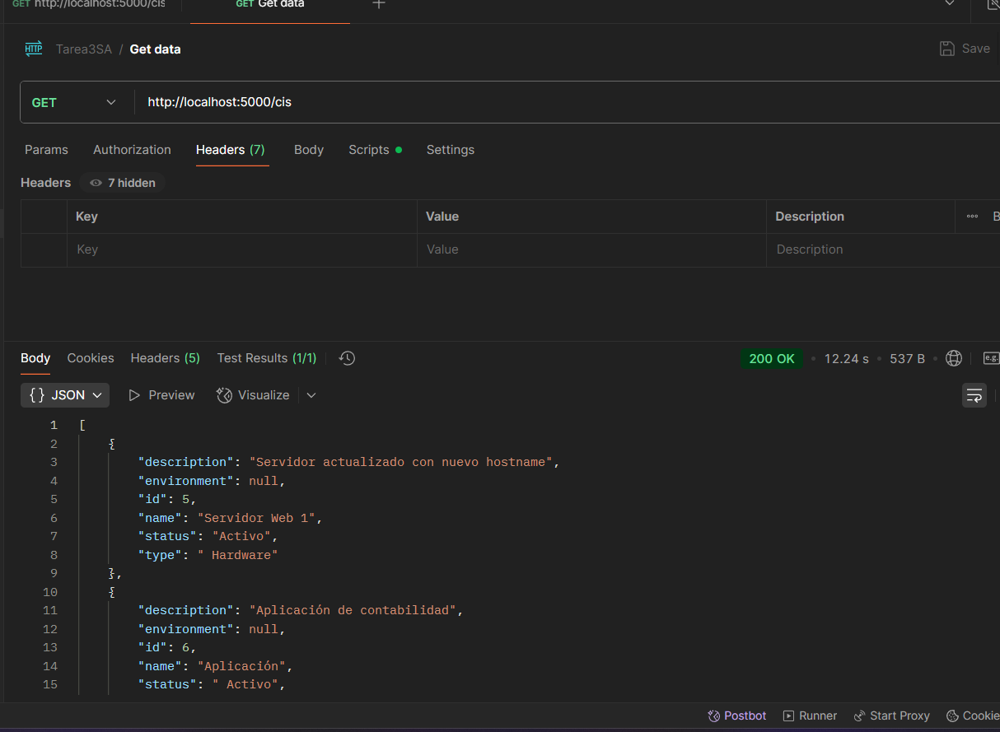
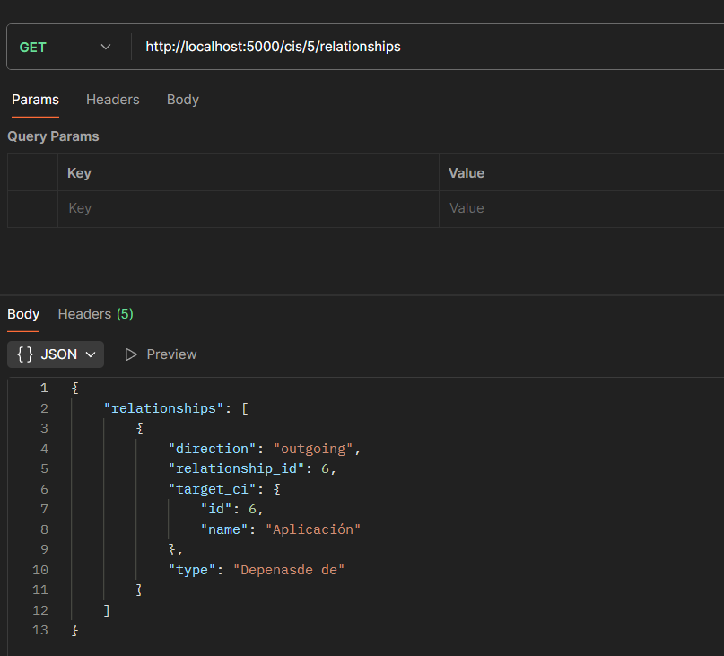
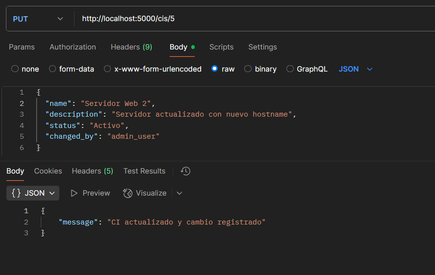
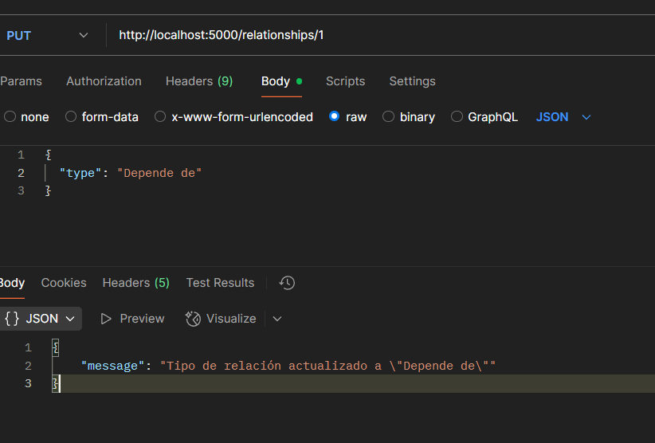
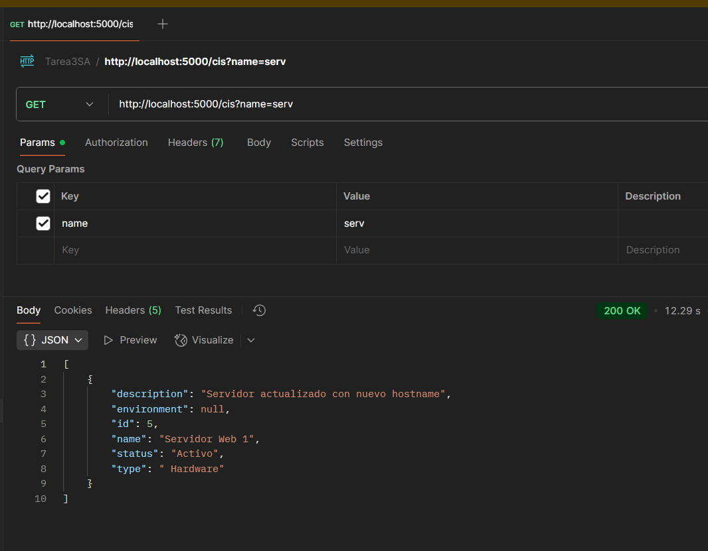

[Regresar](../README.md)

# Documentación API

## Endpoints principales

- GET /cis - Lista todos los CIs, admite filtros por query params (name, type, status, environment)
- GET /cis/<id> - Obtener CI específico
- POST /cis - Crear nuevo CI
- PUT /cis/<id> - Actualizar CI (requiere campo changed_by)
- GET /cis/<id>/relationships - Obtener relaciones de un CI
- GET /cis/<id>/changes - Historial de cambios (auditoría)

### GET /cis
- Descripción: Obtiene todos los CIs, permite filtros opcionales.
- Query Params:
  - `name` (string) - Filtra por nombre (LIKE %name%)
  - `type` (string) - Filtra por tipo exacto ('servidor', 'base de datos', etc.)
  - `status` (string) - Filtra por estado
  - `environment` (string) - Filtra por ambiente ('DEV', 'QA', 'PROD')
- Respuesta: JSON array con CIs.

### GET /cis/{id}
- Descripción: Obtiene CI específico.
- Respuesta: JSON con los detalles del CI.

### POST /cis
- Descripción: Crea un nuevo CI.
- Body JSON: campos obligatorios `name`, `type`, `environment`, más campos según tipo.
- Respuesta: ID del CI creado.

### PUT /cis/{id}
- Descripción: Actualiza CI.
- Body JSON: campos a modificar + `changed_by`.
- Respuesta: Mensaje de éxito o error.

### GET /cis/{id}/relationships
- Descripción: Obtiene relaciones entrantes y salientes.

### GET /cis/{id}/changes
- Descripción: Obtiene historial de cambios para auditoría.

---

# Ejemplos de algunos endpoint usando Postman

## Mostrar todos los CI

## Obtener relaciones

## Registrar logs y Actualizar CI

## Registrar logs y Actualizar relacion

## Buscar por caracter

[Regresar](../README.md)
